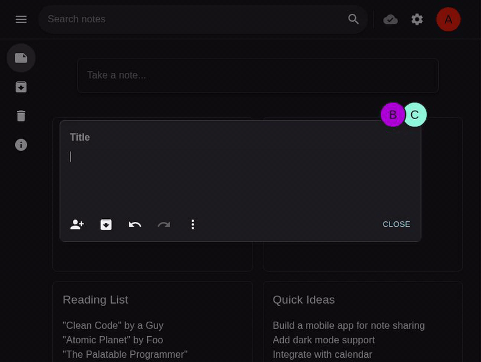
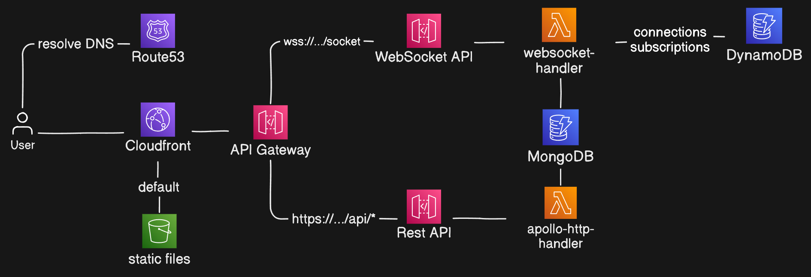

# Notes

A modern, single-page note-taking app with real-time collaborative editing, built as a serverless application on AWS Lambda.

- **Front-end:** React web app using [Apollo Client](https://www.apollographql.com/docs/react/) and [Material UI](https://mui.com/)
- **Back-end:** GraphQL API powered by [Apollo Server](https://www.apollographql.com/docs/apollo-server), [MongoDB](https://www.mongodb.com/) (for data), and [DynamoDB](https://aws.amazon.com/dynamodb/) (for WebSocket subscription state)

## Demo

[](https://notes.knemerzitski.com)

## Features

- Real-time collaborative editing with operational transformation
- Per-user version history
- Full offline support with Progressive Web App (PWA) features
- Live presence and caret position tracking for collaborators
- Secure note sharing via unique links and QR codes
- Multi-account support, including a privacy-focused local-only account
- Drag-and-drop note organization
- Responsive, high-performance user interface
- Mobile-friendly design
- Dark mode
- Serverless, cost-efficient architecture using managed cloud services
- Infinite scroll with cursor-based pagination and auto-refresh for notes

## Getting Started

**Prerequisites:**

- [Docker](https://www.docker.com/) (for local MongoDB and DynamoDB)
- [Node.js](https://nodejs.org/) (v22+ recommended)
- [AWS CLI](https://aws.amazon.com/cli/) (optional, for deployment)

**Development:**

1. Install dependencies: `npm install`
2. Generate GraphQL code: `npm run graphql:gen`
3. Start development mode: `npm run dev`
4. Open [http://localhost:5173](http://localhost:5173) in your browser

## Motivation

I built this project to showcase my ability to develop robust, full-stack applications using modern web technologies and cloud-native architectures.
Note-taking is a widely applicable use case that highlights core challenges of most web apps, including real-time sync and offline-first design.
By leveraging managed cloud services like AWS Lambda, MongoDB, and DynamoDB, I aimed to build a scalable, serverless solution aligned with current industry demands.

## Architecture

Notes is designed to be always available and cost-effective by leveraging AWS Lambda and other managed services.
MongoDB is used for its flexible schema and easy integration with AWS.
The architecture supports real-time collaboration and sharing without the need for a dedicated server.

**Architecture diagram:**  


## Packages Overview

- **collab:**  
  Core collaborative editing logic, including operational transformation based on [easysync-full-description](./packages/collab/docs/easysync-full-description.pdf).
- **api:**  
  GraphQL API logic, MongoDB schemas, and DataLoader for efficient data fetching.
- **lambda-graphql:**  
  Lambda handlers for GraphQL HTTP requests and WebSocket subscriptions. Subscription state is managed in DynamoDB.  
  Based on [Graphql Lambda Subscriptions](https://github.com/reconbot/graphql-lambda-subscriptions).
- **app:**  
  React front-end with account management, note sharing, and local notes.
- **infra:**  
  AWS CDK code for deploying infrastructure as CloudFormation templates.
- **api-dev-server:**  
  Local development server that adapts Lambda handlers for Express and WebSocket, enabling fast local development.

## Testing

This project includes:

- **Unit and integration tests** (run with [Vitest](https://vitest.dev/))
- **End-to-end tests** for the app (run with [Cypress](https://www.cypress.io/))

**To run all tests locally:**

1. Install dependencies: `npm install`
2. Build all packages: `npm run ci:step:build`
3. Start local databases (required for integration and end-to-end tests): `npm run db:start`
4. Run all tests: `npm run test`

**To visually run Cypress end-to-end tests only:**

1. Start local databases: `npm run db:start`
2. Build API for local usage: `npm run -w dev-server build`
3. Start test version of the API: `npm run api:start:test`
4. Build test version of the app: `npm run -w app build:test`
5. Start test version of the app: `npm run app:start:test`
6. Open Cypress UI: `npm run cypress`

Cypress end-to-end tests can also be run in headless mode:

```bash
npm run -w app test:e2e:run
```

**To check code coverage:**

Packages `app` and `collab` have coverage installed.
Run them with package-specific commands, e.g. `npm run -w collab coverage`.

Tests are also run automatically on each pull request via GitHub Actions.

## Deployment

**Prerequisites:**

- [Node.js](https://nodejs.org/) (v22+)
- [AWS CLI](https://aws.amazon.com/cli/) installed and configured (`aws configure`)

**Steps:**

1. Clone the repository and install dependencies:
   ```bash
   git clone https://github.com/knemerzitski/notes.git
   cd notes
   npm install
   ```
2. Create and fill `.env.production.local` with your production configuration.  
   See `.env.example` for required variables.
3. Build the project:
   ```bash
   npm run ci:step:build
   ```
4. Deploy infrastructure with AWS CDK:
   ```bash
   npm run deploy
   ```

**After deployment:**

- The output will include the deployed app’s URL.
- Visit the URL to verify the deployment.

**To remove the deployed stack:**

```bash
(cd packages/infra && npx cdk destroy)
```

## Stack

- React
- Material UI
- Vite
- PWA
- Apollo GraphQL
- WebSockets
- MongoDB
- DynamoDB
- AWS Lambda
- AWS CDK
- Docker
- GitHub Actions
- TypeScript
- Vitest

## License

Notes is [MIT licensed](./LICENSE).
